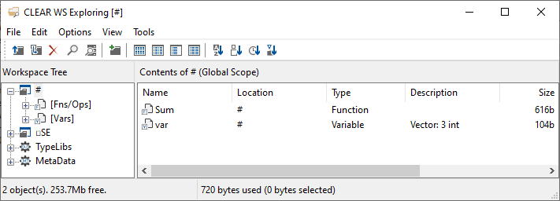

# Development Environment
This is a guide to getting started with the Dyalog Integrated Development Environments on supported platforms. For help with the APL language, see [our language guide](../language/index.md).

Dyalog provides two [integrated development environments](https://www.codecademy.com/article/what-is-an-ide) (IDEs). There is the Dyalog IDE for Microsoft Windows, and the Remote IDE or [(RIDE)](https://github.com/dyalog/ride) for use on Linux and macOS. As the name suggests, the RIDE also provides remote interaction and debugging capabilities over a network.

!!! Note
	The RIDE must be installed separately on Linux. For more information, see the [Dyalog for UNIX Installation and Configuration Guide](https://docs.dyalog.com/latest/Dyalog%20for%20UNIX%20Installation%20and%20Configuration%20Guide.pdf).

This page talks about parts of the development environment common to both IDEs. While you do not need to know all of this to get started using APL to solve problems, it is useful to understand the terminology when you want to develop applications, ask for help or report issues.

## Basic layout
The basic layouts for both standard development environments are described in [section 2.2 of Mastering Dyalog APL](https://mastering.dyalog.com/Getting-Started.html#first-contact).

## The active workspace
This is the currently running collection of names. That is, functions, operators, objects and variables which are accessible to the currently running application.

List names in the active workspace:

```APL
      var ← 1 2 3
      Sum ← {+/⍵}
      ]names
Sum var 
```

Use [the workspace explorer](#the-workspace-explorer) to view names in the active workspace (including the [session object](#the-session-object)).

## The session
This can refer to [the session log](#the-session-log), [the session object](#the-session-object) and [the session file](#the-session-file). Sometimes, the term is used to mean executing code directly in the REPL, in contrast to the phrase "*under program control*". Something *under program control* is a line in a function which is run when that function is run. For example, you can use [user commands](https://docs.dyalog.com/latest/User%20Commands%20User%20Guide.pdf) in the session, but not under program control.

*[REPL]: Read Evaluate Print Loop

### The session log
This is a record of everything you have typed into the session and output from those expressions.

You can save this log as a **.dlf** file using **Log** → **Save As** on Windows.

Log files with the extension **.dlf** can only be opened in Dyalog. To save the log as plain text, on any platform, use the following expression [obtained from APLcart](https://aplcart.info/?q=save%20session%20file#):

```APL
      {⍵ ⎕NPUT⍨⊂⎕SE⎕WG'Log'} '/path/to/file.dlf'
```

The log file is updated when Dyalog closes. Delete the log file before opening Dyalog to start with a clean log file.

TODO: can .dlf be saved from APL? in RIDE?

### The session object
The **session object** ([documentation](http://help.dyalog.com/latest/#UserGuide/The%20APL%20Environment/Session%20Object.htm)), or **session namespace**, is a special system object called `⎕SE` which is accessible from APL. It contains all of your settings for things like `]boxing` and [print width (`⎕PW`)](http://help.dyalog.com/latest/#Language/System%20Functions/pw.htm), as well as window and toolbar settings in the Windows IDE.

### The session file
This is a file with the extension **.dse**. It contains the value of a [session object](#the-session-object). You can use multiple session files to save separate configurations of your development environment.

The current session file location is the value of the `Session_File` [configuration parameter](http://help.dyalog.com/latest/#UserGuide/Installation%20and%20Configuration/Configuration%20Parameters/session_file.htm).

```APL
      ]config Session_File
 Session_File  C:\Users\Dyalog\Documents\Dyalog APL-64 18.2 Unicode Files\def_uk.dse 
```

On Windows, you can overwrite the current session file with **Session → Save** in the menu.

On any platform, the following expression can be used to save the current session configuration to a new file:

```APL
      {2⎕NQ⎕SE'FileWrite'⊣⎕SE⎕WS'File'⍵}'/path/to/file.dse'
```

On Windows, go to **Options → Configure** to set the session file in the **Session** tab. On Linux and macOS, set the `Session_File` configuration parameter. See the documentation for [how to use configuration parameters](http://help.dyalog.com/latest/#UserGuide/Installation%20and%20Configuration/Configuration%20Parameters.htm).

TODO: are ALLCAPS config params safer cross platform than otherwise?

## The workspace explorer
This tool provides an overview of all of the names in your active workspace.



In the Windows IDE, go to **Tools → Explorer**.

In the RIDE, go to **View → Show Workspace Explorer**.