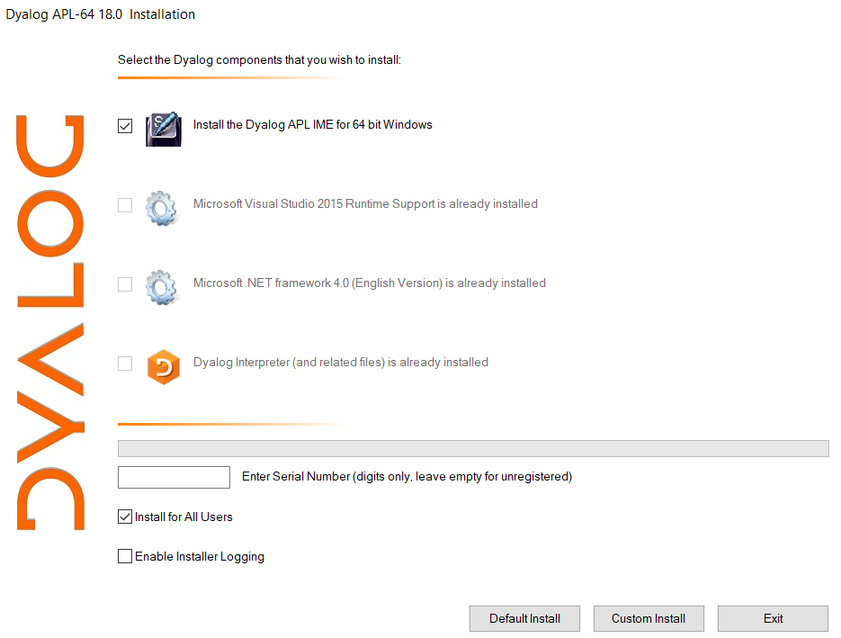

# Quick Start
This is a guide to getting started with the Dyalog Integrated Development Environments on supported platforms. For help with the APL language, see [our language guide](language/index.md).

## Installation
Dyalog provides standard installation packages for popular operating systems. You can download them from [the Dyalog website](https://www.dyalog.com/download-zone.htm).

### Microsoft Windows
Microsoft Windows installations come with the Dyalog Integrated Development Environment for Windows. The full Installation and Configuration Guide is available [from the Dyalog website](https://docs.dyalog.com/latest/Dyalog%20for%20Microsoft%20Windows%20Installation%20and%20Configuration%20Guide.pdf).

See [Mastering Dyalog section 2.2.2](https://mastering.dyalog.com/Getting-Started.html#the-standard-microsoft-windows-interpreter-working-environment)

### macOS
Installations on macOS come with the [Remote Integrated Development Environment (RIDE)](https://github.com/Dyalog/ride). The full Installation and Configuration Guide is available [from the Dyalog website](https://docs.dyalog.com/latest/Dyalog%20for%20macOS%20Installation%20and%20Configuration%20Guide.pdf).

### Linux
Linux installations do not come with the RIDE, but it can be downloaded [from GitHub](https://github.com/Dyalog/ride/releases/latest).

Dyalog can be installed on Raspberry Pi using the apt package manager - details are on [packages.dyalog.com](https://packages.dyalog.com/).

#### Raspberry Pi

#### Chromebook

## Typing APL Symbols
Dyalog APL's standard US English layout is as follows:
<pre class="language-APL" id="kbd-en-US">
┌────┬────┬────┬────┬────┬────┬────┬────┬────┬────┬────┬────┬────┬─────────┐
│~ ⌺ │! ⌶ │@ ⍫ │# ⍒ │$ ⍋ │% ⌽ │^ ⍉ │& ⊖ │* ⍟ │( ⍱ │) ⍲ │_ ! │+ ⌹ │Backspace│
│` ⋄ │1 ¨ │2 ¯ │3 < │4 ≤ │5 = │6 ≥ │7 > │8 ≠ │9 ∨ │0 ∧ │- × │= ÷ │         │
├────┴──┬─┴──┬─┴──┬─┴──┬─┴──┬─┴──┬─┴──┬─┴──┬─┴──┬─┴──┬─┴──┬─┴──┬─┴──┬──────┤
│Tab    │Q   │W   │E ⍷ │R   │T ⍨ │Y   │U   │I ⍸ │O ⍥ │P ⍣ │{ ⍞ │} ⍬ │| ⊣   │
│       │q ? │w ⍵ │e ∊ │r ⍴ │t ~ │y ↑ │u ↓ │i ⍳ │o ○ │p * │[ ← │] → │\ ⊢   │
├───────┴┬───┴┬───┴┬───┴┬───┴┬───┴┬───┴┬───┴┬───┴┬───┴┬───┴┬───┴┬───┴──────┤
│Caps    │A   │S   │D   │F   │G   │H   │J ⍤ │K ⌸ │L ⌷ │: ≡ │" ≢ │Enter     │
│Lock    │a ⍺ │s ⌈ │d ⌊ │f _ │g ∇ │h ∆ │j ∘ │k ' │l ⎕ │; ⍎ │' ⍕ │          │
├────────┴──┬─┴──┬─┴──┬─┴──┬─┴──┬─┴──┬─┴──┬─┴──┬─┴──┬─┴──┬─┴──┬─┴──────────┤
│Shift      │Z ⊆ │X   │C   │V   │B   │N   │M   │< ⍪ │> ⍙ │? ⍠ │Shift       │
│           │z ⊂ │x ⊃ │c ∩ │v ∪ │b ⊥ │n ⊤ │m | │, ⍝ │. ⍀ │/ ⌿ │            │
└───────────┴────┴────┴────┴────┴────┴────┴────┴────┴────┴────┴────────────┘
</pre>
Several international keyboard layouts exist with charts available from [the dfns website](https://dfns.dyalog.com/n_keyboards.htm).

### Microsoft Windows
If you select "Install the Dyalog APL IME for 64 bit Windows" during installation, you will have an additional keyboard input method with the ability to type APL symbols by holding the <kbd>Ctrl</kbd> key. 

In Windows 10, you can use <kbd>⊞ Win</kbd>+<kbd>Space</kbd> to choose between available keyboard layouts.

### Linux (including Raspberry Pi) and macOS
See [the APL Wiki page on Typing Glyphs](https://apl.wiki/Typing_glyphs).

### macOS

## Usage
There are [plugins for VSCode]() with some features for writing code. For execution and debugging, you will need to use one of the development environments provided by Dyalog.

### Dyalog for Microsoft Windows
This is 

### The RIDE
This is the default development environment for macOS and Linux, including Raspberry Pi.

#### Straight to the session shortcut for Linux
On Linux, it can be inconvenient to open the RIDE and then separately start a session with the local interpreter. 

### Saving your work

#### Code
If you are starting a new project and simply want to keep your work saved as you go.

1. Create a link between your [project namespace]() and a folder on your file system.

          ]create proj /tmp/proj

2. Change into your project namespace

          ⎕CS proj

3. Start coding!
	Every time

If you have a more 

#### Data

#### Keeping your variables

### The editor
The in-built editor can be used to modify

- [User-defined functions]()
- [User-defined operators]()
- Character vectors and matrices
